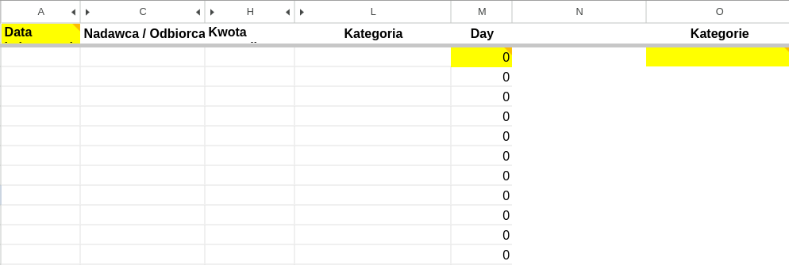
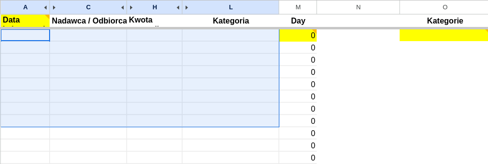
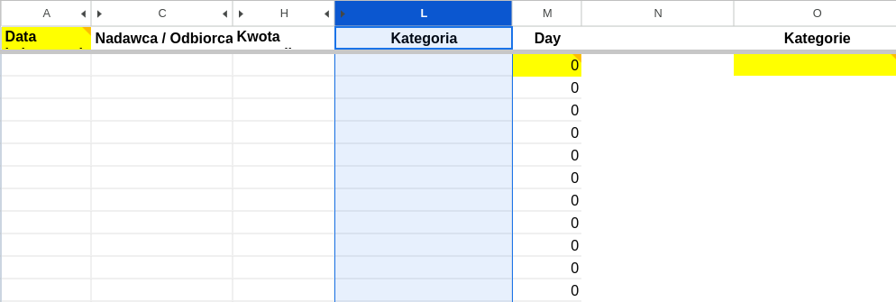
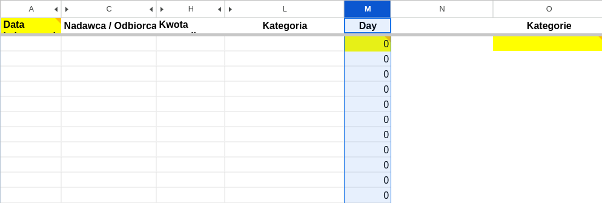
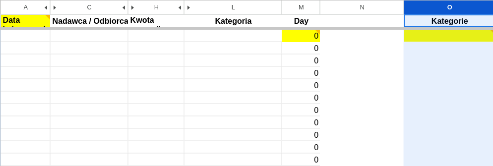
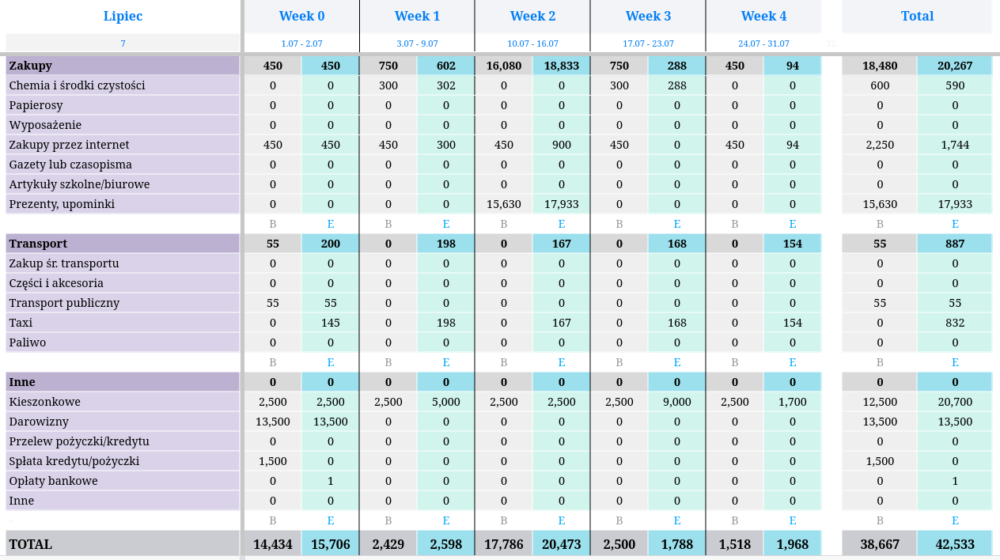
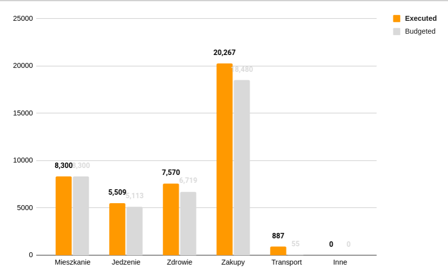

# Monthly Budget
Control your finances! Plan how much to spend on each category, and then track your expenses throughout the month.

## [monthly-budget-template.xlsx](monthly-budget-template.xlsx)
| Cell | Functionality |
|-------|------|
|  | The first sheet: "TRANSACTIONS". |
|  | Here you should be pasting the .csv data from your bank account's transaction history. Unnecessary data should land in the hidden columns (B, D-G, I-K). |
|  | Transactions' categories column: the data in another sheet will be grouped by these categories. Most banks are categorizing transactions automatically, however, you might consider your own modifications. |
|  | Assuming your bank uses a "DD.MM..." date format, the formulas in this column will retrieve only the day number of each transaction (needed for grouping them in another sheet by the week). |
|  | This column will contain a unique list of all categories - without repetitions. |
|  | The second sheet: "THE EXPENSES TABLE". This is how it will look like after pasting a list of transactions in the first sheet. |
|  | A comparison diagram: budgeted costs versus executed costs. |
